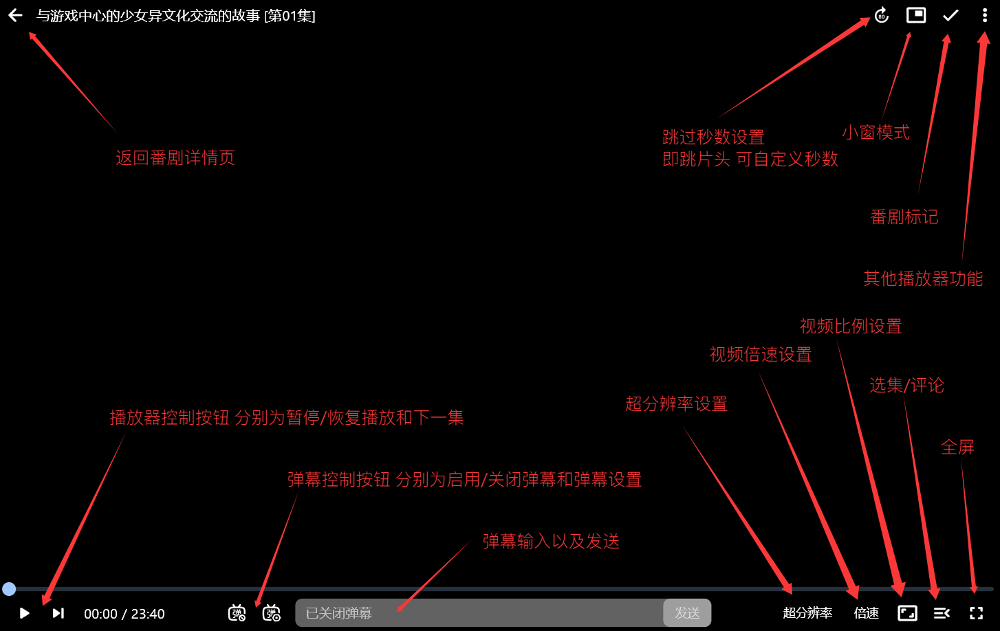

# 功能模块

## 推荐

功能位置：`主页` - `推荐`

这是Kazumi的推荐页，在这里查看一些推荐的番剧或通过上方 `热门番组` 下拉框进行标签过滤。

想要回到顶部？点击右下角的箭头按钮即可。

## 搜索

功能位置：`主页` - `放大镜（左上角）`

点击后会弹出搜索框，在这里输入你要查找的番名，按下回车键即可搜索。在搜索结果页面也可以通过右下角的 `排序方式` 按钮，通过热度、评分、匹配程度来排序。

## 时间表

功能位置：`主页` - `时间表`

在这里你可以查阅本周更新的番剧有哪些，可以通过上方的星期序列来查看本周某一天更新的番剧有哪些。同时，可以通过右下角 `排序方式` 按钮，通过热度、评分、匹配程度来排序。

## 追番

功能位置：`主页` - `追番`

在这里你可以查看你在番剧详情页为番剧设置的标记，例如想看、想看、搁置、看过、抛弃。点击右上角的 `"笔"` 按钮还可以修改你想修改的番的标记。

## 历史记录

功能位置：`主页` - `我的` - `历史记录` 或 `主页` - `推荐` - `历史记录（右上角）`

Kazumi 使用番剧源网站的播放列表进行播放和观看历史的记录，历史记录的番剧信息则来自 Bangumi。请尽量不要从第一部的番剧详情页中打开观看第二部的内容以保证历史记录的正确性。

## 规则管理

功能位置：`主页` - `我的` - `规则管理`

Kazumi 通过 XPath 规则来获取不同番剧源的视频链接并解析播放。软件安装时自带了三个规则，在`规则管理`界面可以找到。通过该界面右上角 `+` 可从规则仓库、剪切板添加规则，或手动创建规则。

规则仓库建立在 [GitHub 仓库](https://github.com/Predidit/KazumiRules)上，使用 raw 直链进行获取。因此常出现中国大陆地区无法访问的问题。
软件内提供了便捷的导航措施，在无法访问规则仓库时可以快速开启 GitHub 镜像功能，无须额外配置。

## 番剧详情

功能位置：`点击任意番剧封面`

在详情页可以浏览由Bangumi提供的番剧详情，例如简介、标签、角色、评论等，点击右上角按钮可跳转至此番剧对应的Bangumi页面。

点击右下角 `开始观看` 按钮可以查看各个规则提供的视频源，点击任意可用源以及对应番剧名即可观看，点击规则列表右侧的按钮可跳转至对应规则源的搜索结果页面。

## 视频播放页

功能位置：`点击任意番剧封面` - `开始播放`

Windows端播放器页面控件说明：

### 弹幕切换

功能位置：`视频播放页` - `右上角三个点`

用于通过番剧名手动检索弹幕

### 视频详情

功能位置：`视频播放页` - `右上角三个点`

查看当前视频的状态信息以及播放器日志，点击可复制

### 远程投屏

功能位置：`视频播放页` - `右上角三个点`

支持对使用DLNA协议的设备进行远程投屏

> [!IMPORTANT]
> 投屏设备和被投屏设备需要在同一网络环境下

### 外部播放

功能位置：`视频播放页` - `右上角三个点`

此功能可以唤起外部播放器进行播放，例如通过PotPlayer播放

### 一起看

功能位置：`视频播放页` - `右上角三个点`

此功能可以让您和您的朋友一起看番，可以自动同步当前观看进度、下一集、进度条操作等

如何使用？

1. 点击切换服务器，在选择服务器列表中和您的朋友选择 `相同端口的公共服务器`，如果您有自己的SyncPlay服务器，也可在此处自定义

2. 点击加入房间，输入一个房间号以及您的用户名，参与一起看的每个人需要填写 `相同的房间号`，完毕后点击确定即可，您会注意到 `当前房间` 状态变为已加入并显示 `网络延时`

3. 此时所有一起看的用户进度会以第一名加入房间的用户为准，其余用户也可以随意控制进度以及播放状态，现在可以愉快的看番了

4. 不想和其他人一起看了？点击 `断开连接` 即可

## 播放设置

功能位置：`主页` - `我的` - `播放设置`

设置播放器相关参数

### 硬件解码

通过独立显卡进行视频解码，默认启用

### 硬件解码器

这里可以设置视频解码采用的解码器，通常采用默认设置即可，不需要修改。

> [!TIP]
> 仅在硬件解码启用时生效，选择不受支持的解码器将回退到软件解码

### 低内存模式

禁用高级缓存以减少内存占用，默认不启用

### 超分辨率

这里可以对超分辨率进行设置，默认为OFF禁用超分辨率

超分辨率的模式：

1. OFF (默认禁用超分辨率)

2. Efficiency (默认启用基于Anime4K的超分辨率 效率优先)

3. Quality (默认启用基于Anime4K的超分辨率 质量优先)

> [!TIP]
> 超分辨率需要启用硬件解码，若启用硬件解码后仍然不生效，尝试切换硬件解码器为 `auto-copy`

> [!WARNING]
> 超分辨率 `Quality` 模式对设备要求较高，在中低端显卡或Soc下极易造成卡顿，谨慎启用

### 自动跳转

自动跳转到上次播放位置，默认启用

### 错误提示

显示播放器内部错误提示，默认启用

### 调试模式

记录播放器内部日志，默认关闭

### 隐身模式

不保留观看记录，即不会在历史记录中显示你看过的内容，默认关闭

### 默认倍速

可以调整默认的视频播放倍速，范围为 `0.25x` - `3.0x`，默认为 `1.0x`

### 默认视频比例

可以调整默认的播放视频比例，有 `自动` ，`裁切填充` 以及 `拉伸填充`模式，默认为 `自动`

## 弹幕设置

功能位置：`主页` - `我的` - `弹幕设置`

设置弹幕相关参数

### 默认开启

默认是否随视频播放弹幕，默认关闭

### 弹幕来源

控制视频弹幕的来源，有 `BiliBili`，`Gamer`，`DanDan` 三种来源，默认全部启用

### 关键词屏蔽

可以设置通过指定关键词或正则表达式进行弹幕屏蔽

> [!TIP]
> 以"/"开头和结尾将视作正则表达式，如"/\d+/"表示屏蔽所有数字

### 弹幕区域

设置弹幕在视频显示的区域占比，默认为 `100%`

### 顶部弹幕

设置顶部弹幕是否显示，默认启用

### 底部弹幕

设置底部弹幕是否显示，默认关闭

### 滚动弹幕

设置滚动弹幕是否显示，默认启用

### 海量弹幕

弹幕过多时进行叠加绘制，默认关闭

### 弹幕描边

设置弹幕样式是否描边，默认启用

### 弹幕颜色

设置弹幕样式是否有颜色，默认启用

### 字体大小

设置弹幕字体大小

### 字体字重

设置弹幕字体字重

### 弹幕不透明度

设置弹幕不透明度

## 同步设置

功能位置：`主页` - `我的` - `同步设置`

设置同步参数

### Github镜像

使用镜像访问规则托管仓库，默认禁用

### WebDAV 同步

Kazumi 目前仅使用 WebDAV 进行追番和观看记录同步，暂不支持与 Bangumi 官网进行同步。具体搭建与使用方法可在 B 站找到大量教程。

追番内容目前不能 `自动` 通过 WebDAV 同步，需要在追番界面手动点击同步按钮进行同步

### 观看记录同步

允许自动同步观看记录，必须启用 `WebDAV同步` 才会生效

### WebDAV配置

设置WebDAV的同步参数

### 手动上传

立即上传观看记录到WEBDAV

### 手动下载

立即下载观看记录到本地

## 关于

功能位置：`主页` - `我的` - `关于`

在这里查看Kazumi的所有开源许可证以及相关外部链接

### 关闭时

设置Kazumi每次关闭时的默认行为，可以设置为 `退出 Kazumi` 或 `最小化至托盘`，默认为每次都询问

### 错误日志

这里是你遇到问题提issues需要提供的日志文件，点击右下角按钮可清除或复制

### 清除缓存

用于清除番剧封面缓存，清除后加载时需要重新下载

### 自动更新

允许Kazumi自动检查是否有最新版本，默认启用

### 检查更新

用于手动检查Kazumi是否有最新版本，在这里也可以查看当前的Kazumi版本