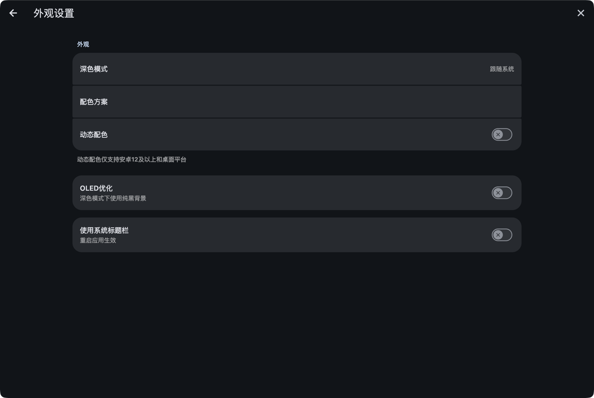
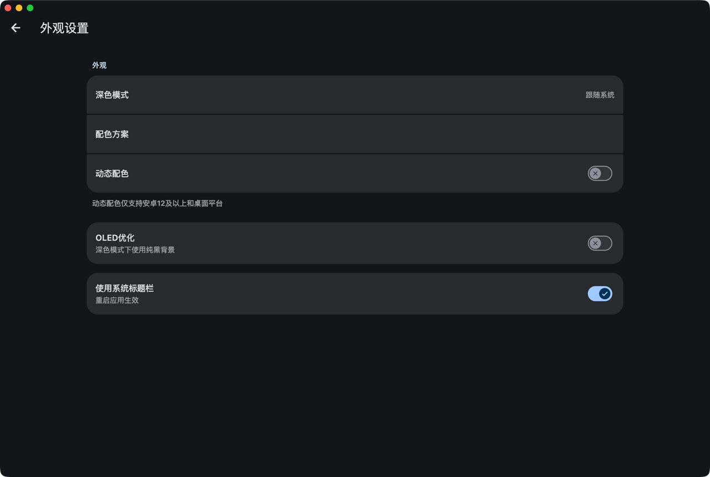

# 软件界面

## 系统标题栏

在电脑端，可以通过 `我的` - `外观设置` - `使用系统标题栏` 来开启，默认关闭。

| 开启前                                     | 开启后                                       |
|-----------------------------------------|-------------------------------------------|
|  |  |
