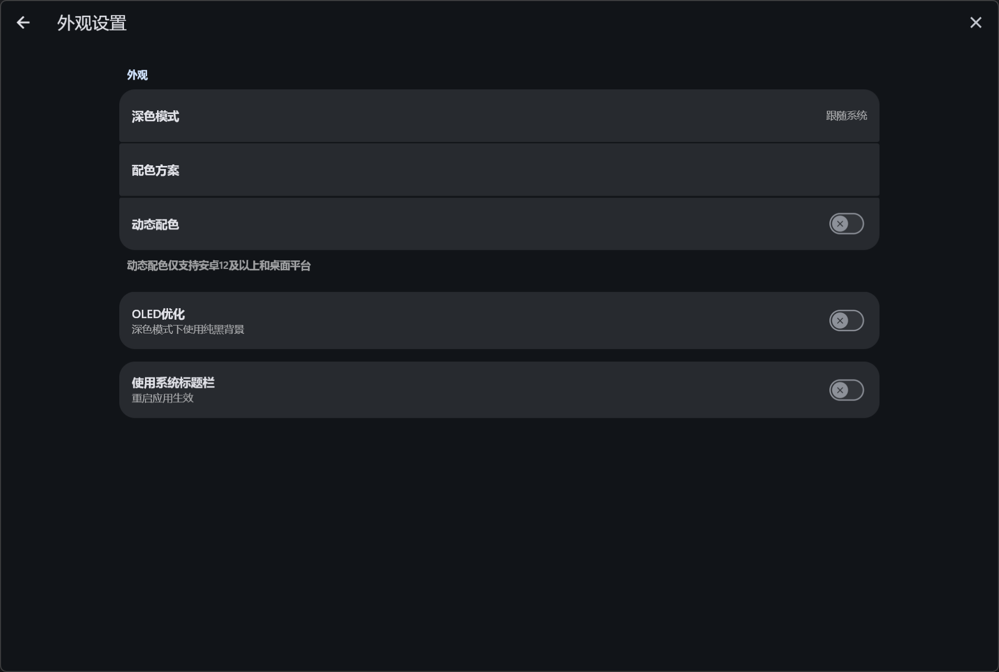
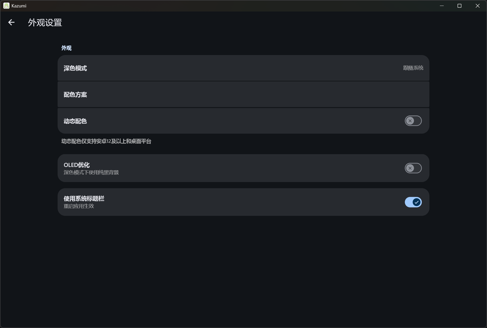
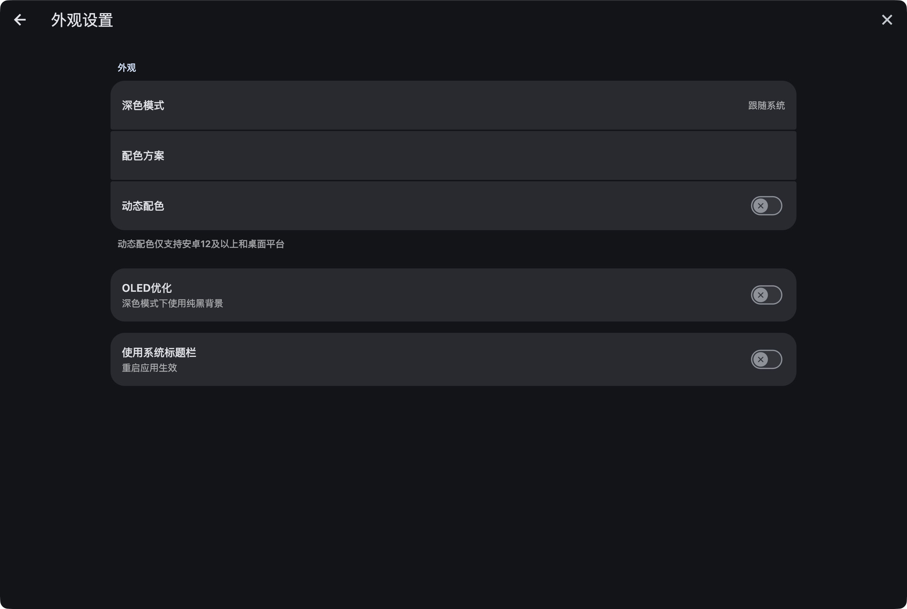
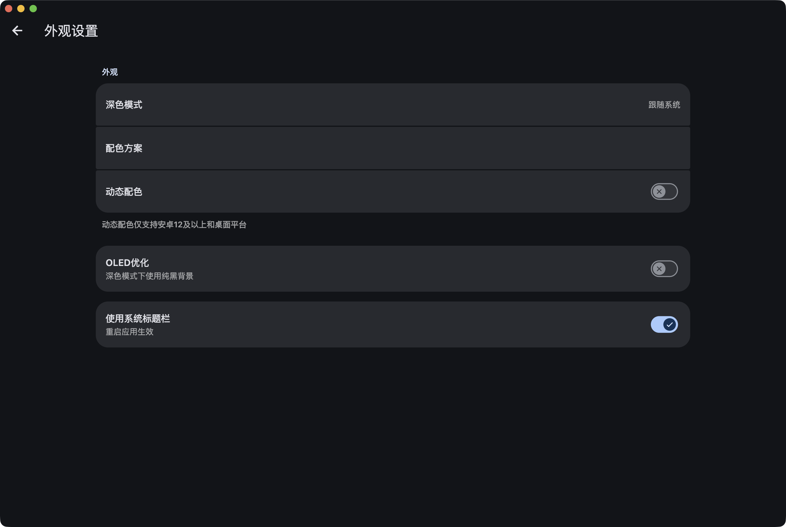
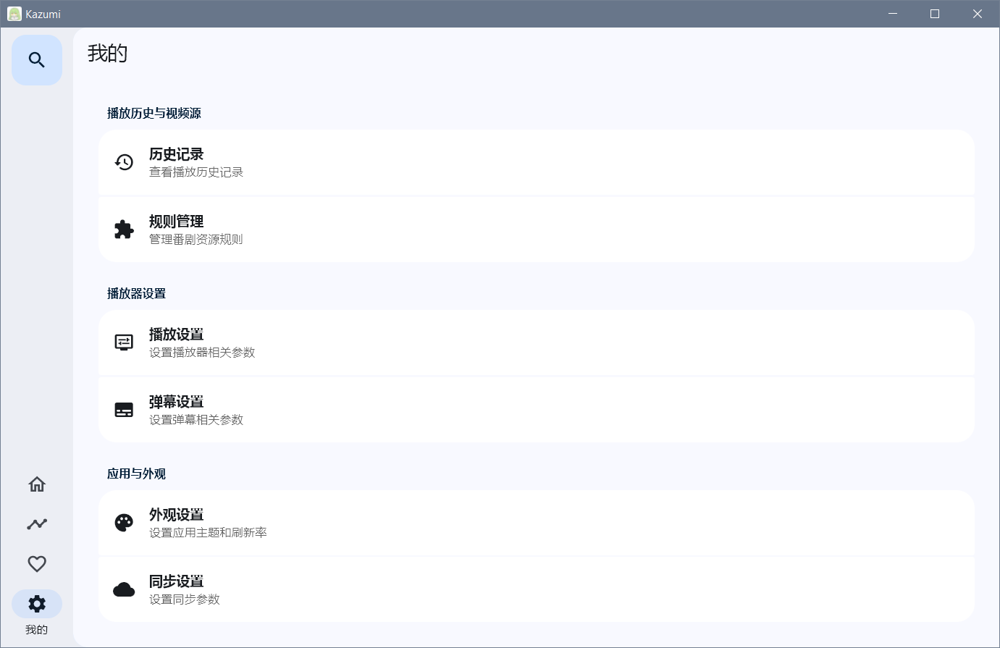
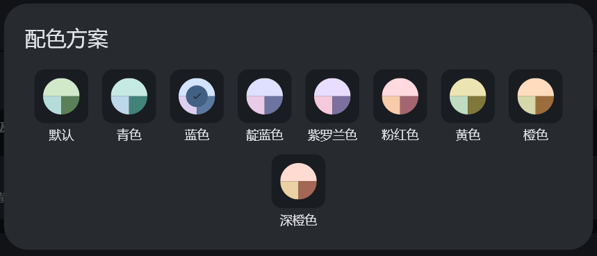
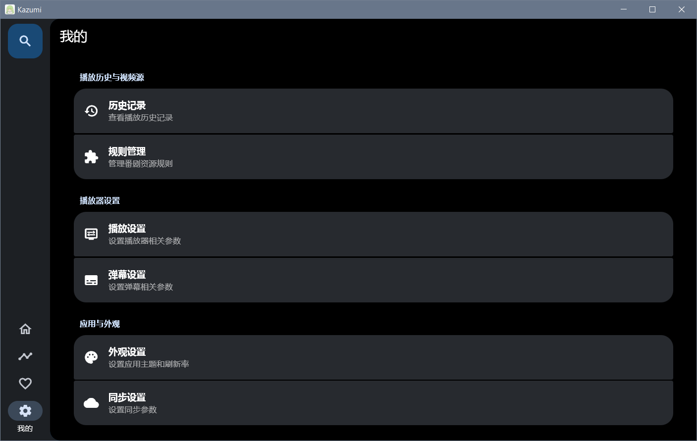

# 软件界面

## 系统窗口控制按钮

在电脑端，可以通过 `我的` - `外观设置` - `使用系统标题栏` 来开启，默认关闭。

| 开启前                                       | 开启后                                    |
|-------------------------------------------|----------------------------------------|
|  |  |
|  |  |

## 深色模式

在电脑端，可以通过 `我的` - `外观设置` - `深色模式` 来开启，默认跟随系统。

| 深色                                      | 浅色                                    |
|-------------------------------------------|----------------------------------------|
|  |  |

## 配色方案

在电脑端，可以通过 `我的` - `外观设置` - `配色方案` 进行调整，默认为初始配色。

在这里你可以为Kazumi设置你喜欢的配色方案

## 动态配色

在电脑端，可以通过 `我的` - `外观设置` - `动态配色` 来开启，默认关闭。

> [!TIP]
> 仅支持安卓12及以上和桌面平台

## OLED优化

在电脑端，可以通过 `我的` - `外观设置` - `OLED优化` 来开启，默认关闭。

在深色模式下会使用纯黑背景

效果如图：

| 开启前                                      | 开启后                                    |
|-------------------------------------------|----------------------------------------|
|  |  |