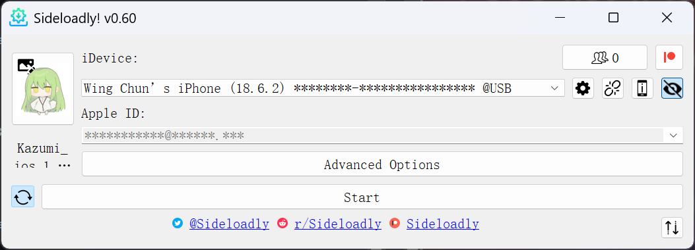
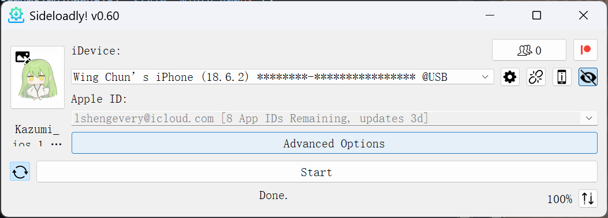
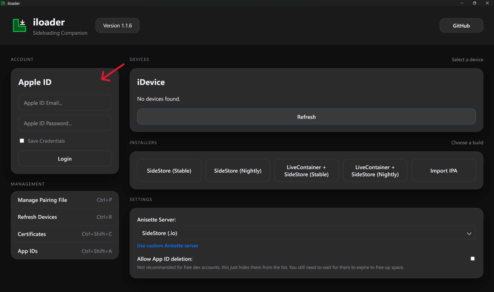
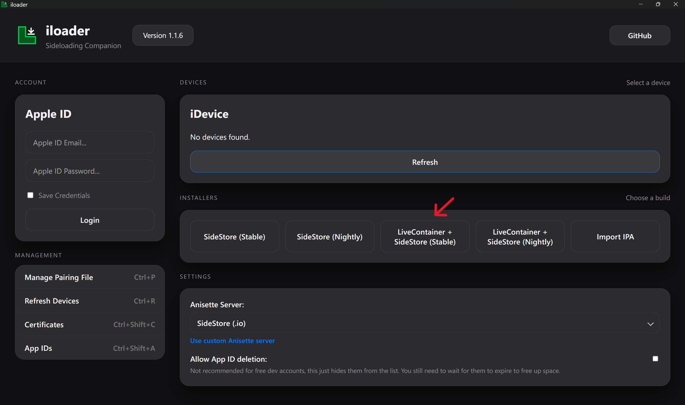
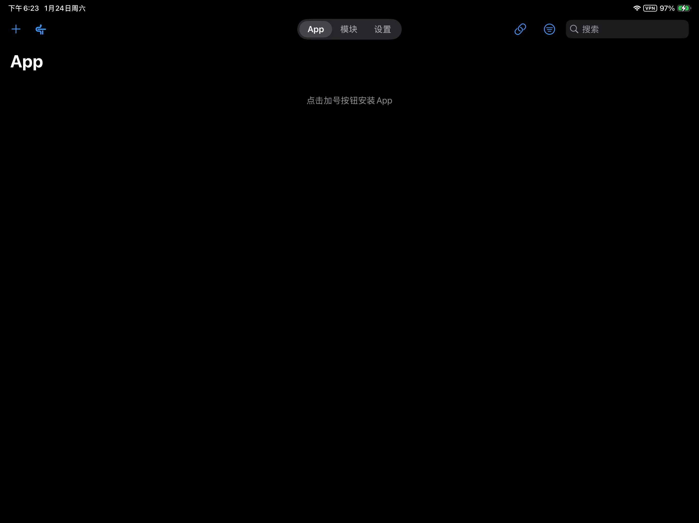
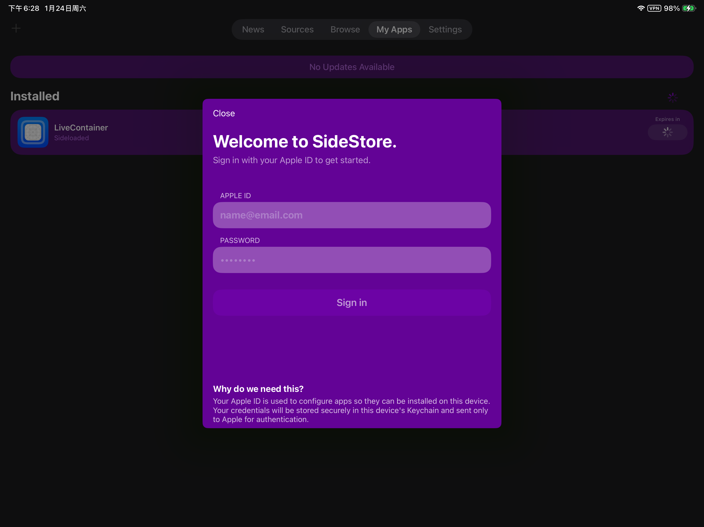
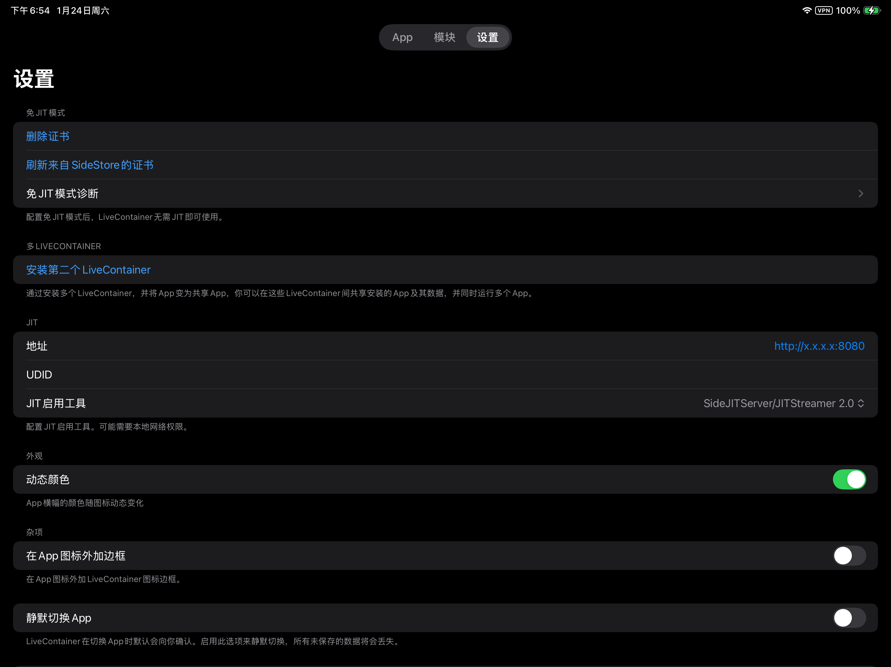

# iOS 安装教程

在 iOS 设备上安装未上架应用需要使用“侧载”（Sideload）工具。本教程将详细介绍两种安装方案：**Sideloadly** 和 **LiveContainer + SideStore**。

这两种方法均利用了 Apple 提供的开发者签名功能。对于未成为 Apple Developer Program 会员的用户，存在以下限制：
- 应用签名有效期为 7 天，到期后需重新续签，否则应用将无法打开。
- 单个 Apple ID 最多同时安装 3 个侧载应用。

## 准备工作

无论选择哪种方法，在开始前请确保做好以下准备：

- **硬件**：一台 macOS 或 Windows 电脑、一台 iPhone 或 iPad，请使用一根稳定的数据线，否则可能无法正确连接设备。
- **账号**：一个使用邮箱注册的 [Apple ID](https://support.apple.com/zh-cn/apple-account)。
- **安装包**：从[下载页面](/download.html)下载 IPA 安装包。
- 对于 Windows 用户，必须安装 [iTunes](https://www.apple.com.cn/itunes/)。

> [!IMPORTANT]
> iTunes 需要为非 Microsoft Store 版本，如果安装了 Microsoft Store 版本，请卸载并从官网下载。


## 方法一：使用 Sideloadly 安装


### 1. 下载 Sideloadly

请根据你的操作系统下载 [Sideloadly](https://sideloadly.io/#download)。

> [!TIP]
> **Windows 用户提示**：通常请下载 64 位版本。如果不确定系统类型，可按 `Win` + `R`，输入 `msinfo32`，在“系统类型”中查看。

### 2. 安装 IPA


1. 打开 Sideloadly，在 `Apple ID` 栏输入你的 Apple 账号邮箱。

2. 连接设备，使用数据线将 iOS 设备连接至电脑。
   - 手机上若弹出“要信任此电脑吗？”，请点击**信任**并输入锁屏密码。
   - 连接成功后，你的设备名称将出现在 `iDevice` 栏中。

3. 点击左侧的 IPA 图标，选择已下载的 Kazumi IPA 文件，点击 `Start` 按钮开始安装。
    > [!TIP]
    > `Start` 按钮左侧的“刷新图标”建议保持开启状态（默认即开启）。这允许设备在同一 Wi-Fi 环境下每 7 天自动续签。

    

4. 首次使用时，需输入 Apple ID 密码。若开启了双重认证，请在弹窗中输入手机收到的 6 位验证码。

5. 等待进度条跑完，当显示 `Done.` 时即表示安装成功。

   

## 方法二：使用 LiveContainer+SideStore 安装

### 1. 安装 iloader

请根据你的操作系统下载 [iloader](https://github.com/nab138/iloader/releases/latest)。

### 2. 开启开发者模式（iOS 16+）

如果是 iOS 16 及以上系统，必须启用开发者模式才能运行侧载应用：
- 前往 `设置` -> `隐私与安全性` -> 拉到底部找到 `开发者模式` -> **开启**。
- 按提示重启设备并确认开启。

### 3. 安装 LiveContainer + SideStore
1.  启动 iloader。
2.  连接 iOS 设备至电脑，解锁并选择“信任此电脑”。
3.  登录 Apple Account。
    
4.  安装 LiveContainer+SideStore
    
5. 信任 LiveContainer。
    1. 打开 iOS `设置` -> `通用`。
    2. 向下滑动选择 `VPN 与设备管理`（旧版本系统可能显示为“描述文件与设备管理”）。
    3. 在 `开发者 APP` 下方点击你的 Apple ID。
    4. 点击 **“信任 [你的邮箱]”** 并确认。

### 4. 配置 LiveContainer & SideStore
1.  下载 [LocalDevVPN](https://apps.apple.com/hk/app/localdevvpn/id6755608044)（需要外区ID）。
2.  保持 LocalDevVPN 全程开启。
3.  打开 LiveContainer。
4.  点击左上方 SideStore 图标（首次会闪退）。
    
5.  打开 SideStore，切换到 **My Apps** 标签页。
6.  点击 `Refresh All`，输入你的 Apple Account 账户及密码。
    
7.  退出 SideStore，再次进入 LiveContainer，切换到 **设置** 标签页，点击 `从 SideStore 导入证书`。
    

### 5. 安装 Kazumi

- **直接安装文件（不占用侧载应用数量）**：
    1.  将 IPA 文件发送到手机（如通过 AirDrop 或 文件App）。
    2.  如果进入了 SideStore，退出再重新进入
    3.  点击左上角 **“+”**，选择 IPA 文件进行安装。

- **通过源安装（更新更方便）**：
    1.  打开 SideStore，切换到 **Sources** 标签页，点击右上角 **“+”**。
    2.  添加源地址：
        ```
        https://raw.githubusercontent.com/WingChunWong/Kazumi-AltStore-Source/kazumi/generated/apps.json
        ```
    3.  添加后点击 **Kazumi** 源，找到 Kazumi 点击安装。


## 常见问题：不受信任的开发者

首次启动 Kazumi 时，可能会提示`不受信任的开发者`。

**解决方法**：
1.  打开 `设置` -> `通用`。
2.  向下滑动选择 `VPN 与设备管理`（旧版本系统可能显示为“描述文件与设备管理”）。
3.  在 `开发者 APP` 下方点击你的 Apple ID。
4.  点击 **“信任 [你的邮箱]”** 并确认。