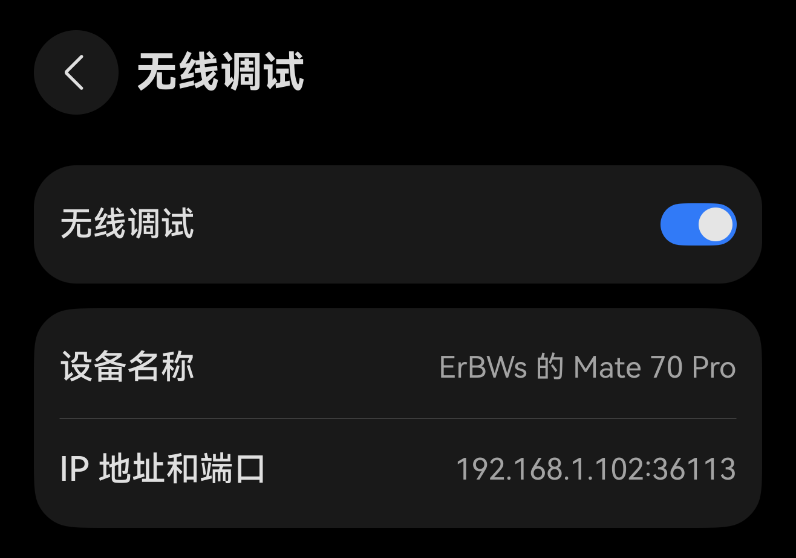
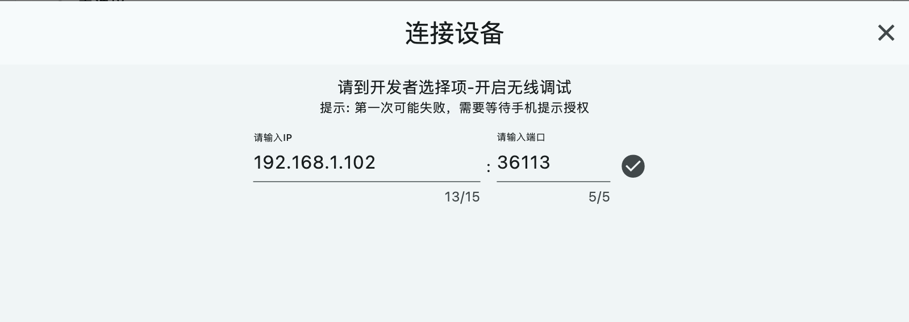
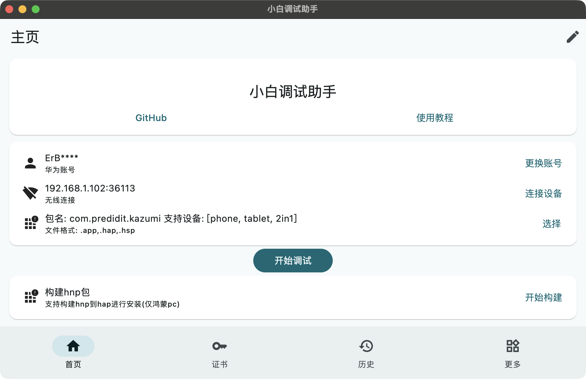

# ohos 侧载

## 准备工作

- [Kazumi hap 安装包](https://github.com/ErBWs/Kazumi/releases/latest)
- 一台任意非鸿蒙 5.0 及以上的设备。

### 小白调试助手

从 GitHub 仓库 [Release](https://github.com/likuai2010/auto-installer/releases) 中下载两个平台的安装包，其中一个需要为 `.hap` 安装包，用于后续软件更新使用；另一个可以为任意平台。

> [!IMPORTANT] 注意事项
> 
> **Windows:** 首次打开会提示安装 Java，下载安装即可。
> 
> **macOS:** 首次运行需要在终端运行 `xattr -d com.apple.quarantine /Applications/小白调试助手.app`。需要 Java 环境。
> 
> **Linux:** 不能使用 root 权限，依赖 [zenity](https://gitlab.gnome.org/GNOME/zenity)。

### 开启无线调试

打开`设置` - `设备名称`，进入`关于本机`页面。快速点击 5 下 `软件版本` 打开开发者模式。

转到`设置` - `系统` - `开发者选项`页面，找到并点击`无线调试`，在二级页面中开启无线调试，获取设备的 IP 地址和端口。

### 开发者账号

侧载中需要使用开发者账号进行签名。开发者账号未实名时侧载后的应用仅有 14 天有效期，实名后会延长至 180 天，因此首先需要进行实名认证。

1. 打开[华为开发者联盟 - 开发者信息](https://developer.huawei.com/consumer/cn/console/setting/profile)页面，注册或登录华为账号。
2. 填写个人基本信息进行实名认证。

## 侧载 Kazumi

1. 登录账号

点击`登录账号`，在浏览器中登录华为账号，点击`允许`访问，等待出现`登录成功！请返回！`。

2. 连接设备

点击`连接设备`，在弹出窗口中输入上面获取的 IP 地址和端口，点击按钮进行连接。

3. 选择 .hap 文件

点击`选择`，选择下载好的 Kazumi hap 包，完成后会在软件内显示软件包名及支持安装的设备。

4. 侧载安装

点击`开始调试`，等待全部操作成功完成侧载。若出现错误可根据错误信息进行操作解决，并重新`开始调试`。

## 便捷更新

使用相同方法侧载小白调试助手的 hap 包，后续软件内更新时会下载 hap 包并发送到小白调试助手，只需要登录华为账号并连接设备就可以便捷侧载。

## 其他

- 查询调试证书有效期：[网址](https://developer.huawei.com/consumer/cn/service/josp/agc/index.html#/harmonyOSDevPlatform/9249519184596237889)
